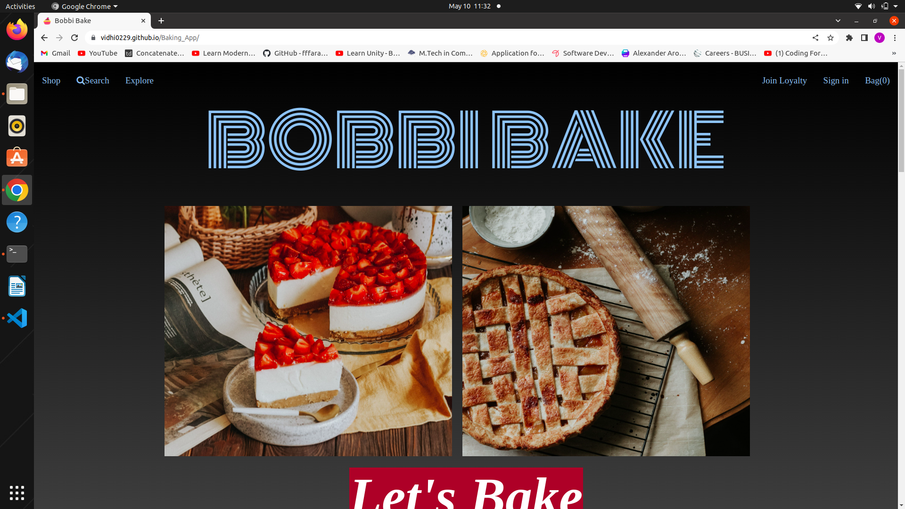
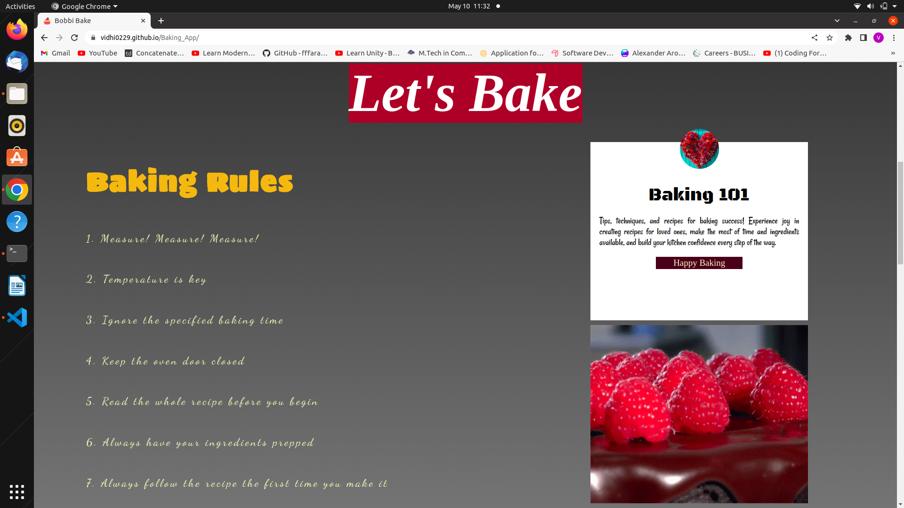
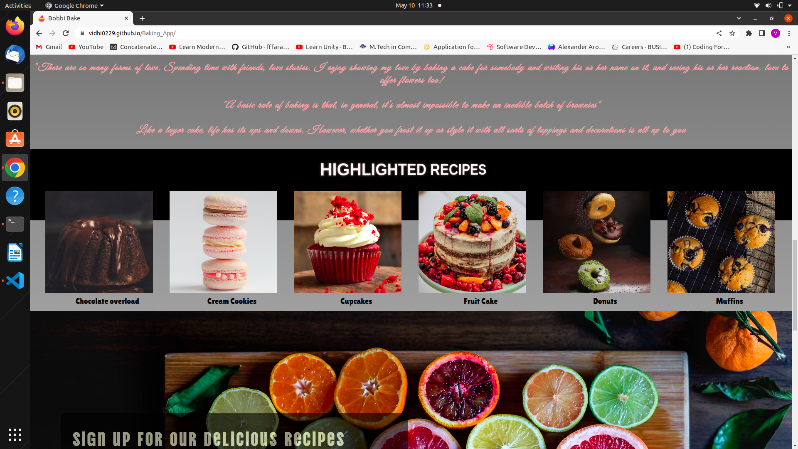
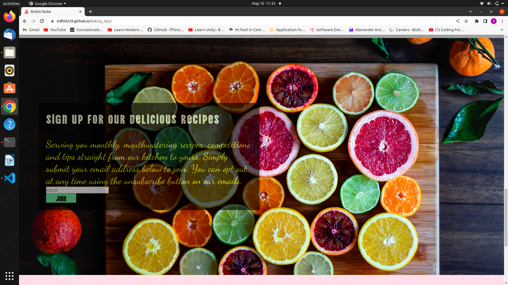

# Baking_App

A Baking app.

Its a UI for a baking app where users can look for different baking recipes and can add there own recipes. 

## Built With

HTML
CSS

## Live Demo

[Try a live demo](https://vidhi0229.github.io/Baking_App/)

## Getting Started

Download or clone this repo by using git clone https://github.com/Vidhi0229/Baking_App.git
Enter the project folder and run locally by using a VS Code extension such as Live Server.

## Authors 👤

### Vidhi Srivastava

_[Github](https://github.com/Vidhi0229)

_[LinkedIn](https://www.linkedin.com/in/vidhisrivastava01/)

## Show your support ⭐️⭐️

Give a star if you like this project!

## License 📝

This project is [MIT](https://www.mit.edu/~amini/LICENSE.md) licensed.